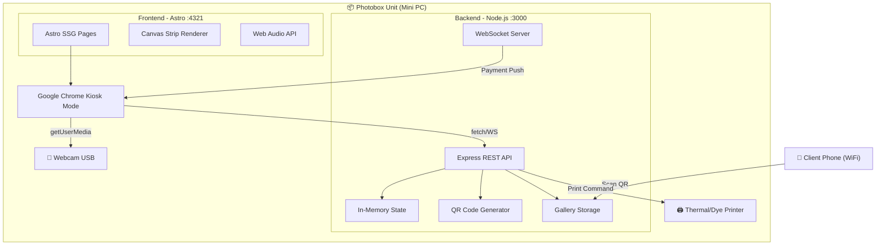
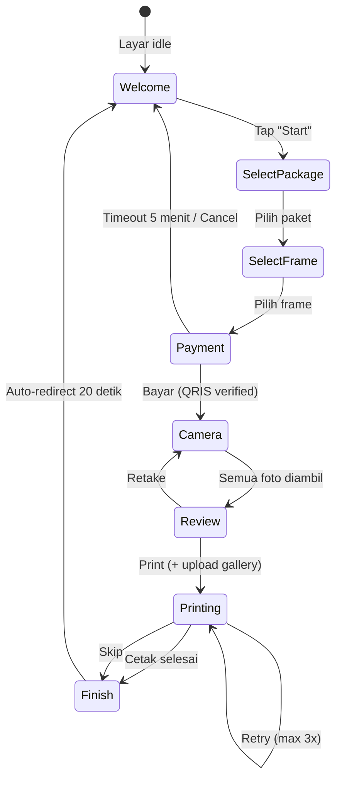
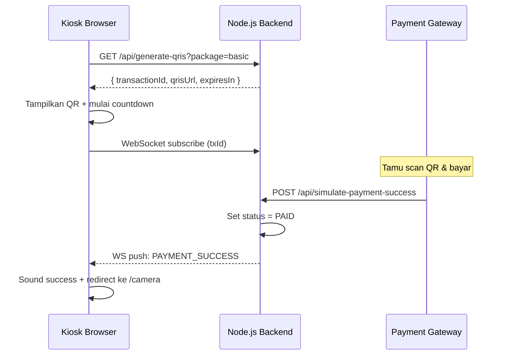
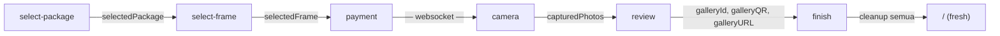

# 📸 Photobox Studio — Dokumentasi Lengkap

## Deskripsi Aplikasi

**Photobox Studio** adalah aplikasi kiosk self-service untuk photo booth portabel. Aplikasi ini berjalan secara lokal di sebuah **Windows Mini PC** yang terpasang di dalam unit photobox fisik. Tidak membutuhkan hosting cloud — semua berjalan di `localhost`.

Pengguna (tamu di event/cafe/venue) berinteraksi langsung dengan layar sentuh di photobox. Mereka memilih paket, memilih frame, membayar via QRIS, berfoto, dan menerima hasil cetak + file digital.

---

## Arsitektur Sistem



### Teknologi

| Layer | Teknologi | Port |
|-------|-----------|------|
| Backend | Node.js + Express + WebSocket | `:3000` |
| Frontend | Astro (SSG) + Tailwind CSS | `:4321` |
| Browser | Google Chrome (Kiosk Mode) | — |
| Sound | Web Audio API (synthesized) | — |
| Rendering | HTML5 Canvas | — |
| Camera | WebRTC `getUserMedia` | — |

---

## User Flow (Alur Pengguna)



---

## Detail Setiap Halaman

### 1. 🏠 Welcome (`/`)

**File:** [index.astro](file:///C:/Users/halim/OneDrive/Desktop/Photobox%20Sys/photobox-frontend/src/pages/index.astro)

| Item | Detail |
|------|--------|
| Tujuan | Layar idle/standby yang menarik perhatian |
| Interaksi | Tap layar → navigasi ke `/select-package` |
| Visual | Ikon kamera besar (animated pulse), gradient title, ambient background orbs |
| Sound | Beep saat tap |

---

### 2. 📦 Select Package (`/select-package`)

**File:** [select-package.astro](file:///C:/Users/halim/OneDrive/Desktop/Photobox%20Sys/photobox-frontend/src/pages/select-package.astro)

| Item | Detail |
|------|--------|
| Tujuan | Pilih paket foto |
| Pilihan | **Classic Strip** (3 foto, Rp 30.000) atau **Premium Grid** (4 foto, Rp 45.000) |
| Data | Simpan `selectedPackage` ke `localStorage` |
| Navigasi | → `/select-frame` |

**Paket:**
| Paket | Layout | Jumlah Foto | Harga |
|-------|--------|-------------|-------|
| `basic` | Strip vertikal (1 kolom) | 3 | Rp 30.000 |
| `premium` | Grid 2×2 | 4 | Rp 45.000 |

---

### 3. 🖼️ Select Frame (`/select-frame`)

**File:** [select-frame.astro](file:///C:/Users/halim/OneDrive/Desktop/Photobox%20Sys/photobox-frontend/src/pages/select-frame.astro)

| Item | Detail |
|------|--------|
| Tujuan | Pilih style frame untuk foto |
| Data Source | `GET /api/frames` (dari backend) |
| Preview | Canvas-rendered strip preview (ukuran proporsional) |
| Data | Simpan `selectedFrame` ke `localStorage` |
| Navigasi | → `/payment` |

**4 Default Frame:**

| Frame | Background | Border | Filter | Dekorasi |
|-------|-----------|--------|--------|----------|
| Clean White | `#ffffff` | Abu-abu tipis | — | — |
| Vintage Film | `#f5e6d3` (krem) | Gold | Sepia | Film sprockets |
| Neon Glow | `#0a0a0a` (hitam) | Cyan | — | Neon border glow |
| Flower Garden | `#fff0f5` (pink) | Pink | — | Emoji bunga 🌸🌷🌺 |

> [!TIP]
> Frame custom bisa ditambahkan lewat Admin Dashboard — termasuk warna, border, filter, dan dekorasi.

---

### 4. 💳 Payment (`/payment`)

**File:** [payment.astro](file:///C:/Users/halim/OneDrive/Desktop/Photobox%20Sys/photobox-frontend/src/pages/payment.astro)

| Item | Detail |
|------|--------|
| Tujuan | Tampilkan QRIS untuk pembayaran |
| API Call | `GET /api/generate-qris?package=basic` |
| QR Code | Real scannable QR (library `qrcode`, base64 PNG) |
| Real-time | WebSocket mendengarkan `PAYMENT_SUCCESS` |
| Fallback | Polling `GET /api/payment-status/:txId` setiap 2 detik |
| Timeout | 5 menit countdown + auto-expire |
| Navigasi | Bayar berhasil → `/camera` (delay 2 detik) |
| Cancel | Tombol cancel → `/` |

**Alur Payment Detail:**



> [!IMPORTANT]
> Saat ini payment gateway di-**mock**. Endpoint `POST /api/simulate-payment-success` digunakan untuk simulasi. Di production, endpoint ini akan diganti dengan webhook dari payment gateway asli (GoPay/OVO/DANA).

---

### 5. 📷 Camera (`/camera`)

**File:** [camera.astro](file:///C:/Users/halim/OneDrive/Desktop/Photobox%20Sys/photobox-frontend/src/pages/camera.astro)

| Item | Detail |
|------|--------|
| Tujuan | Sesi foto dengan countdown |
| Camera | `navigator.mediaDevices.getUserMedia` (WebRTC) |
| Mirror | Selfie mode (`scaleX(-1)`) |
| Capture | HTML5 Canvas capture → JPEG 90% quality |
| Fallback | Mock mode jika tidak ada kamera |
| Data | Simpan `capturedPhotos[]` ke `localStorage` (data URL) |
| Navigasi | Selesai → `/review` |

**Alur Sesi Foto:**

```
1. "Get Ready!" overlay (3 detik)
2. Hide overlay
3. Loop per foto:
   a. Countdown 3-2-1 (dengan sound beep)
   b. Flash putih + shutter sound
   c. Canvas capture → push ke array
   d. Update dot indicator ✅
   e. "Captured!" badge animation
   f. Delay 2.5 detik antar foto
4. Semua foto selesai → simpan ke localStorage
5. Stop camera stream
6. "Processing..." overlay → redirect ke /review
```

---

### 6. 👁️ Review (`/review`)

**File:** [review.astro](file:///C:/Users/halim/OneDrive/Desktop/Photobox%20Sys/photobox-frontend/src/pages/review.astro)

| Item | Detail |
|------|--------|
| Tujuan | Preview hasil cetak (WYSIWYG) |
| Renderer | Canvas Strip Renderer (`StripRenderer.render()`) |
| Data Source | Frame config: `GET /api/frames/:id`, Photos: `localStorage` |
| Preview | Canvas menggambar strip/grid lengkap dengan frame, dekorasi, footer |
| Info Panel | Package, frame name, photo count, thumbnail grid |

**Tombol Aksi:**

| Tombol | Aksi |
|--------|------|
| **Print This! 🖨️** | Upload foto ke gallery API → simpan QR data → navigasi ke `/printing` |
| **Retake Photos** | Hapus `capturedPhotos` → kembali ke `/camera` |

**Proses saat klik Print:**
1. Disable button + show spinner "Uploading photos..."
2. Get full-res strip dari canvas (`toDataURL`)
3. `POST /api/gallery` dengan `{ photos[], strip, frameId, packageType }`
4. Backend simpan ke disk (`galleries/G-xxx/`)
5. Backend return `{ galleryId, downloadUrl, qrDataUrl }`
6. Simpan ke `localStorage` untuk finish page
7. Navigate ke `/printing`

---

### 7. 🖨️ Printing (`/printing`)

**File:** [printing.astro](file:///C:/Users/halim/OneDrive/Desktop/Photobox%20Sys/photobox-frontend/src/pages/printing.astro)

| Item | Detail |
|------|--------|
| Tujuan | Animasi printing + trigger printer |
| API Call | `POST /api/hardware/printer/trigger` |
| Visual | Animasi kertas keluar dari printer, progress bar, LED status |
| Error | Retry max 3x + skip option |
| Navigasi | Sukses → `/finish` (delay 2 detik) |

**Error Recovery Flow:**
```
Print gagal → LED merah + error UI
  ├── Retry (attempt 2/3) → reset + coba lagi
  ├── Retry (attempt 3/3) → last chance
  ├── Max retries → disable retry button
  └── Skip & Finish → langsung ke /finish
```

---

### 8. 🎉 Finish (`/finish`)

**File:** [finish.astro](file:///C:/Users/halim/OneDrive/Desktop/Photobox%20Sys/photobox-frontend/src/pages/finish.astro)

| Item | Detail |
|------|--------|
| Tujuan | Thank you + download QR + social share |
| QR Code | Menampilkan QR dari `localStorage('galleryQR')` |
| Download Link | URL ke gallery page di local network IP |
| Social | Icon Instagram, X, Facebook |
| Countdown | Auto-redirect ke `/` dalam 20 detik |
| Cleanup | Hapus semua session data dari localStorage |

**Apa yang didapat client:**
- 📷 **Foto mentah** (JPG individual)
- 🖼️ **Photo strip** (dengan frame, dekorasi, branding)

---

### 9. 📊 Admin Dashboard (`/admin`)

**File:** [admin.astro](file:///C:/Users/halim/OneDrive/Desktop/Photobox%20Sys/photobox-frontend/src/pages/admin.astro)

| Section | Isi |
|---------|-----|
| **Stats Cards** | Total sessions, revenue, basic/premium count, active pending, total frames |
| **Quick Actions** | Simulate payment (paste TX ID) |
| **Transaction Table** | ID, package, amount, status badge (PENDING/PAID/EXPIRED), timestamp |
| **System Status** | Backend/Frontend/WebSocket status, Camera/Printer/Payment mode, uptime, version |
| **Revenue Chart** | Canvas bar chart (daily revenue, last 7 days) |
| **Frame Management** | List semua frame dengan canvas preview, delete custom frames |
| **Add Custom Frame** | Modal form: name, colors, border, radius, filter, decorations + **live canvas preview** |

> Auto-refresh setiap 5 detik.

---

## Backend API Reference

### Payment

| Method | Endpoint | Request | Response |
|--------|----------|---------|----------|
| `GET` | `/api/generate-qris?package=basic` | — | `{ transactionId, qrisUrl, amount, expiresIn }` |
| `POST` | `/api/simulate-payment-success` | `{ transactionId }` | `{ success, message }` |
| `GET` | `/api/payment-status/:txId` | — | `{ transactionId, status }` |

### Hardware (Mock)

| Method | Endpoint | Request | Response |
|--------|----------|---------|----------|
| `POST` | `/api/hardware/camera/trigger` | — | `{ success }` (500ms delay) |
| `POST` | `/api/hardware/printer/trigger` | `{ shouldFail? }` | `{ success }` (3s delay) |

### Frames

| Method | Endpoint | Request | Response |
|--------|----------|---------|----------|
| `GET` | `/api/frames` | — | `Frame[]` |
| `GET` | `/api/frames/:id` | — | `Frame` |
| `POST` | `/api/admin/frames` | `Frame data` | `Frame` (201) |
| `PUT` | `/api/admin/frames/:id` | `Frame data` | `Frame` |
| `DELETE` | `/api/admin/frames/:id` | — | `{ success }` |

### Gallery

| Method | Endpoint | Request | Response |
|--------|----------|---------|----------|
| `POST` | `/api/gallery` | `{ photos[], strip, frameId, packageType }` | `{ galleryId, downloadUrl, qrDataUrl }` |
| `GET` | `/gallery/:id` | — | HTML download page |

### Admin

| Method | Endpoint | Response |
|--------|----------|----------|
| `GET` | `/api/admin/stats` | `{ totalSessions, totalRevenue, packageCounts, dailyHistory, activePending, recentTransactions, totalFrames, customFrames }` |

### WebSocket

| URL | Event | Payload |
|-----|-------|---------|
| `ws://localhost:3000/ws?txId=TX-xxx` | `PAYMENT_SUCCESS` | `{ type, transactionId }` |
| | `PAYMENT_EXPIRED` | `{ type, transactionId }` |

---

## Frame Data Model

Setiap frame memiliki properti berikut:

```json
{
  "id": "vintage-film",
  "name": "Vintage Film",
  "subtitle": "Retro Vibes",
  "bgColor": "#f5e6d3",
  "photoBorder": "#c9a87c",
  "photoBorderWidth": 3,
  "photoRadius": 2,
  "textColor": "#8b6914",
  "footerText": "KODAK 400 • Photobox Studio",
  "accentColor": "#d97706",
  "filter": "sepia",
  "decorations": "film-sprockets",
  "isDefault": true
}
```

| Property | Type | Pilihan |
|----------|------|---------|
| `filter` | string | `none`, `sepia`, `grayscale`, `high-contrast` |
| `decorations` | string | `none`, `film-sprockets`, `neon-border`, `flowers` |
| `isDefault` | bool | Default frames tidak bisa dihapus |

---

## Canvas Strip Renderer

**File:** [strip-renderer.js](file:///C:/Users/halim/OneDrive/Desktop/Photobox%20Sys/photobox-frontend/public/js/strip-renderer.js)

Engine berbasis Canvas yang dipakai di 3 halaman:
- `/select-frame` — preview dengan placeholder
- `/review` — preview dengan foto asli
- `/admin` — preview di frame management

### Layout

| Package | Layout | Canvas Size | Photo Size |
|---------|--------|-------------|------------|
| Basic | Strip (vertikal 1 kolom) | 360 × ~830px | 316 × 240px |
| Premium | Grid (2 kolom) | 540 × ~600px | ~255 × 190px |

### Render Pipeline
```
1. Draw background (rounded rect + subtle texture)
2. Draw decorations layer 1 (film sprockets)
3. Load images (async, parallel)
4. Draw photos (cover-fit, border, radius, filter)
5. Draw decorations layer 2 (neon border, flowers)
6. Draw footer (branding text, date, accent line)
```

---

## File Structure

```
Photobox Sys/
├── 🚀 start-kiosk.bat              ← One-click launcher
│
├── 📦 photobox-backend/
│   ├── package.json
│   ├── server.js                    ← Express + WebSocket + Gallery API
│   ├── utils/
│   │   └── state.js                 ← Transaction store + Frame CRUD + Stats
│   └── galleries/                   ← 📸 Uploaded photo galleries (auto-created)
│       └── G-{timestamp}/
│           ├── photo-1.jpg
│           ├── photo-2.jpg
│           ├── photo-3.jpg
│           ├── strip.png
│           └── meta.json
│
└── 🎨 photobox-frontend/
    ├── astro.config.mjs
    ├── package.json
    ├── public/
    │   └── js/
    │       └── strip-renderer.js    ← Canvas rendering engine
    └── src/
        ├── layouts/
        │   └── Layout.astro         ← Base shell + Sound utility
        ├── pages/
        │   ├── index.astro          ← [1] Welcome / Idle
        │   ├── select-package.astro ← [2] Package picker
        │   ├── select-frame.astro   ← [3] Frame picker (canvas preview)
        │   ├── payment.astro        ← [4] QRIS + WebSocket + Timeout
        │   ├── camera.astro         ← [5] Live webcam + capture
        │   ├── review.astro         ← [6] Print preview (canvas WYSIWYG)
        │   ├── printing.astro       ← [7] Print + error recovery
        │   ├── finish.astro         ← [8] Thank you + download QR
        │   └── admin.astro          ← [9] Admin dashboard
        └── styles/
            └── global.css
```

---

## Data Flow (localStorage)

Data yang mengalir antar halaman via `localStorage`:



| Key | Set di | Baca di | Tipe |
|-----|--------|---------|------|
| `selectedPackage` | select-package | select-frame, payment, camera, review | `"basic"` \| `"premium"` |
| `selectedFrame` | select-frame | camera, review | `"clean-white"` \| `"vintage-film"` \| ... |
| `capturedPhotos` | camera | review | `JSON string of data URL[]` |
| `galleryId` | review | finish | `"G-1234567"` |
| `galleryQR` | review | finish | `data:image/png;base64,...` |
| `galleryURL` | review | finish | `http://192.168.x.x:3000/gallery/G-xxx` |

---

## Cara Menjalankan

### Development
```bash
# Terminal 1 — Backend
cd photobox-backend
npm install
node server.js

# Terminal 2 — Frontend
cd photobox-frontend
npm install
npm run dev
```

### Production (Kiosk Mode)
Double-click `start-kiosk.bat` — otomatis:
1. Start backend
2. Start frontend dev server
3. Tunggu 8 detik
4. Launch Chrome kiosk mode (`--kiosk`)

### Akses
| URL | Fungsi |
|-----|--------|
| `http://localhost:4321` | Kiosk interface |
| `http://localhost:4321/admin` | Admin dashboard |
| `http://localhost:3000/api/admin/stats` | Stats JSON |
| `http://<IP>:3000/gallery/<id>` | Client download page |

---

## Yang Masih Mock (Belum Production)

| Komponen | Status | Untuk Production |
|----------|--------|------------------|
| Payment Gateway | 🟡 Mock (simulate endpoint) | Integrasi webhook QRIS asli (Midtrans/Xendit) |
| Camera | 🟢 Real (getUserMedia) | Sudah pakai webcam asli |
| Printer | 🟡 Mock (console.log) | Integrasi driver printer (ESC/POS atau system print) |
| Auth Admin | 🔴 Tidak ada | Tambahkan PIN/password untuk `/admin` |
| Database | 🟡 In-memory | SQLite/LowDB untuk data persist |
| Gallery Cleanup | 🔴 Tidak ada | Auto-delete galleries setelah X hari |
